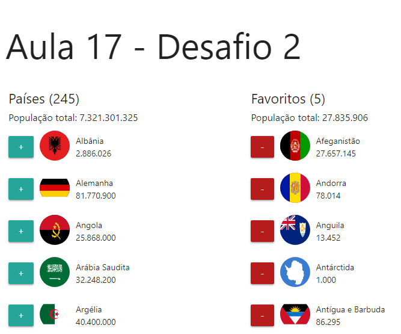

# IGTI BOOTCAMP FULLSTACK - Aula 19 - Desafio 2

# Sobre o projeto
Construa, utilizando HTML, CSS e JavaScript Moderno, uma aplicação para a visualização de informações de países através da API http://restcountries.eu/rest/v2/all. Iterações de incluir e remover em uma nova listagem de favoritos.

# Usabilidade

# Dúvidas?
:mailbox_with_no_mail:[Marcelo Bonilla](https://www.linkedin.com/in/marcelobonilla/)
